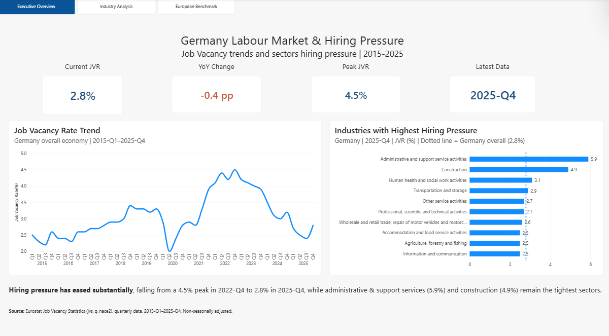
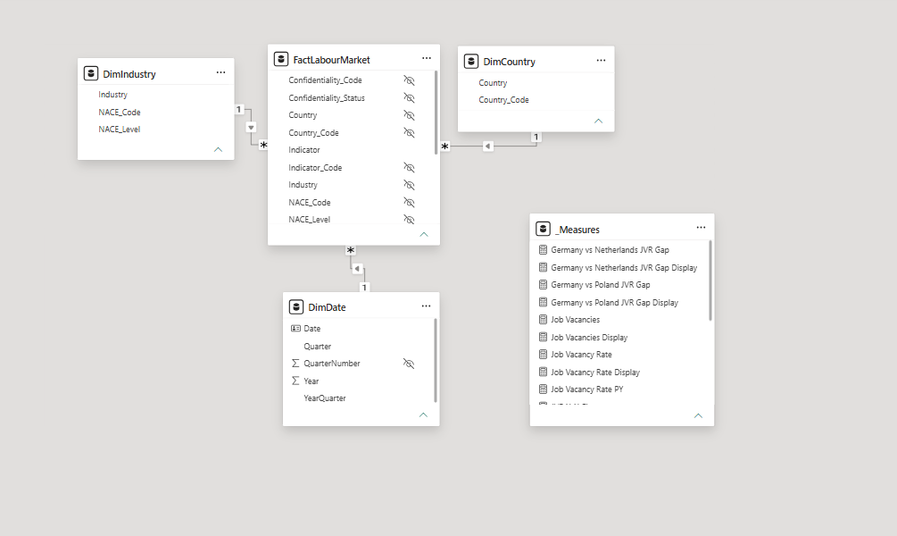
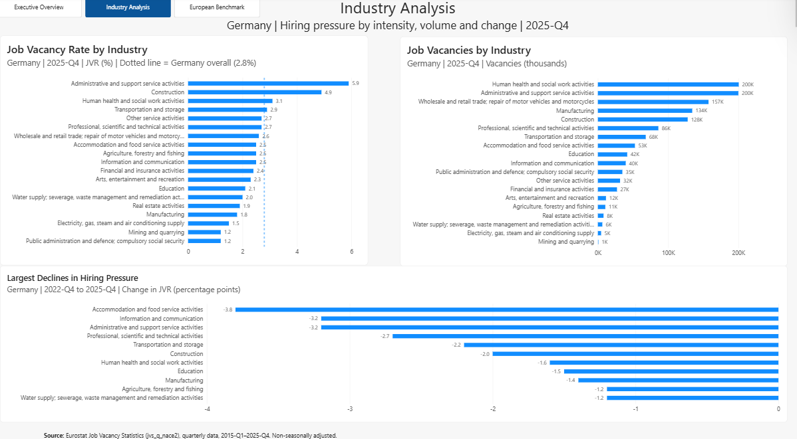
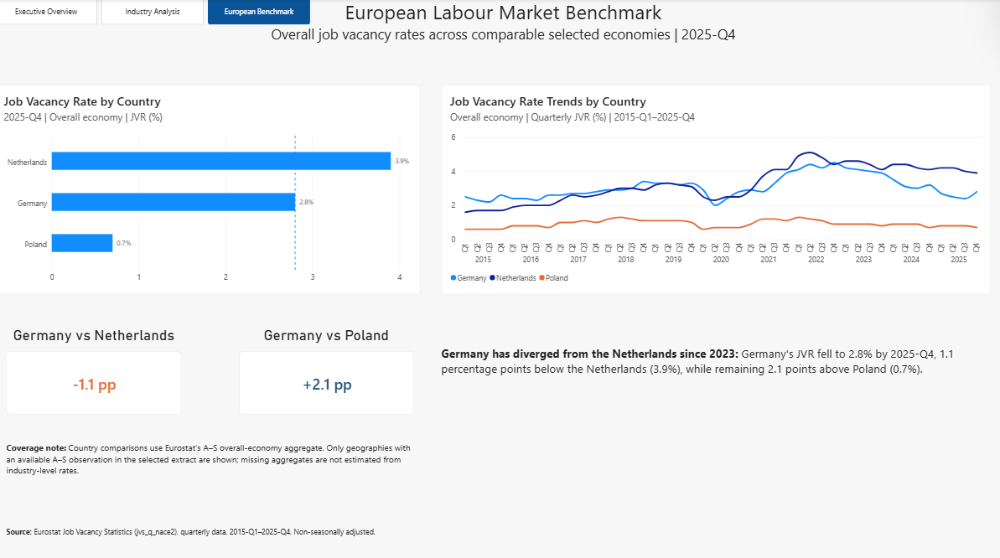

# German Labour Market & Hiring Pressure Analytics

**Power BI | Power Query | DAX | Eurostat | 2015–2025**

A Power BI decision-support dashboard examining how hiring pressure in Germany has changed since 2015, where recruitment pressure remains concentrated, and how Germany compares with European labour markets for which comparable data are available.



## Key Findings

- Germany's Job Vacancy Rate fell from a **4.5% peak in 2022-Q4 to 2.8% in 2025-Q4**, a decline of 1.7 percentage points.
- **Administrative & Support Service Activities** recorded the highest industry JVR at **5.9%**, followed by **Construction at 4.9%**.
- Vacancy intensity and vacancy volume tell different stories: **Health & Social Work had approximately 202,000 vacancies** despite a JVR of 3.1%, while Manufacturing had approximately 134,000 vacancies with a JVR of only 1.8%.
- Hiring pressure has not declined uniformly. Accommodation & Food Services recorded the largest fall between 2022-Q4 and 2025-Q4 at **-3.8 percentage points**, while Administrative & Support fell by 3.2 points but still had the highest JVR in 2025-Q4.
- Within the available comparable country sample, Germany's **2.8% JVR** stood below the Netherlands (**3.9%**) but above Poland (**0.7%**) in 2025-Q4.

## Business Question

**How has hiring pressure across the German labour market changed since 2015, where is recruitment pressure concentrated today, and how does Germany compare with European labour markets for which comparable data are available?**

## Objective

The objective is to build a decision-support view of German hiring pressure using quarterly Eurostat data, separating three dimensions that headline vacancy rates can obscure: **vacancy intensity, the absolute scale of vacancies, and changes in pressure over time**.

The analysis identifies sectors where recruitment pressure remains elevated, distinguishes high-intensity sectors from high-volume hiring markets, and places Germany's current position in a comparable European context.

## Data & Scope

The analysis uses **Eurostat Job Vacancy Statistics (`jvs_q_nace2`)**, covering quarterly labour-market observations from **2015-Q1 to 2025-Q4**. Non-seasonally adjusted data were used to maintain a consistent basis across the analysis.

The dataset provides three principal measures:

- **Job Vacancy Rate (JVR):** vacancy intensity relative to occupied and vacant posts
- **Job Vacancies:** the absolute number of vacant positions
- **Occupied Jobs:** the number of occupied positions

Industry analysis follows **NACE Rev. 2**, using the **A-S overall-economy aggregate** for headline measures and individual NACE sections for sector analysis.

The original extract covered **Germany, Austria, France, the Netherlands, Poland, Spain and EU-27**. However, comparable A-S observations were not available for every selected geography in the extracted data. Cross-country comparisons therefore include only geographies with an available A-S aggregate rather than estimating national vacancy rates from industry-level observations.

## Data Preparation & Quality Assurance

The raw Eurostat SDMX-CSV extract required transformation before analysis. Using **Power Query**, the data were cleaned and reshaped into an analysis-ready fact table, including standardised country and industry fields, quarterly date construction, year and quarter attributes, and a classification separating the **A-S overall economy** from individual NACE industries.

### Data-quality issue identified

During validation, the initial dashboard results did not reconcile with the original Eurostat observations. Germany's Job Vacancy Rate contained decimal values such as **2.5%**, but these were appearing as whole numbers after transformation.

Tracing the discrepancy through the Power Query pipeline revealed that an automatically generated **Changed Type** step had converted the observation-value field to a **Whole Number**, causing decimal precision to be lost.

The transformation sequence was corrected so that the observation value was assigned a **Decimal Number** data type before precision could be lost. Dashboard results were then reconciled against the raw Eurostat observations before analysis continued.

The validation process followed the chain:

**Source observation → Power Query output → DAX measure → Dashboard result**

### Post-transformation validation sample

| Validation check | Source / expected | Dashboard | Status |
|---|---:|---:|:---:|
| Germany JVR, 2015-Q1 | 2.5% | 2.5% | ✓ |
| Germany JVR, 2016-Q1 | 2.4% | 2.4% | ✓ |
| Germany JVR, 2025-Q4 | 2.8% | 2.8% | ✓ |
| Germany peak JVR | 4.5%, 2022-Q4 | 4.5%, 2022-Q4 | ✓ |
| 2025-Q4 YoY change | -0.4 pp | -0.4 pp | ✓ |

## Data Model

The transformed data were organised using a **star schema**, separating labour-market observations from the dimensions used to analyse them.

The model contains:

- **`FactLabourMarket`**: quarterly observations for job vacancies, occupied jobs and job vacancy rates
- **`DimDate`**: calendar, year, quarter and year-quarter attributes supporting time analysis
- **`DimCountry`**: geographic attributes
- **`DimIndustry`**: NACE industry classifications and the distinction between overall-economy and industry observations
- **`_Measures`**: a dedicated table containing analytical DAX measures

Each dimension has a **one-to-many, single-direction relationship** with `FactLabourMarket`, keeping filtering predictable and avoiding unnecessary many-to-many or bidirectional relationships.

Technical fields and metadata required for modelling and traceability were retained but hidden from the report view where appropriate.



### Modelling consideration: avoiding double counting

The Eurostat dataset contains both the **A-S overall-economy aggregate** and observations for individual NACE industries.

This means that summing observations across all NACE categories without controlling the industry level could double count economic activity. Headline measures therefore use the **A-S aggregate**, while sector-level visuals use individual industry observations.

## DAX Measures

Explicit DAX measures were created rather than relying on uncontrolled implicit aggregations.

```DAX
Job Vacancy Rate =
CALCULATE(
    AVERAGE(FactLabourMarket[Value]),
    FactLabourMarket[Indicator_Code] = "JVR"
)

Job Vacancies =
CALCULATE(
    SUM(FactLabourMarket[Value]),
    FactLabourMarket[Indicator_Code] = "JOBVAC"
)

Job Vacancy Rate PY =
CALCULATE(
    [Job Vacancy Rate],
    DATEADD(DimDate[Date], -1, YEAR)
)

JVR YoY Change =
VAR PreviousYearRate = [Job Vacancy Rate PY]
RETURN
    IF(
        ISBLANK(PreviousYearRate),
        BLANK(),
        [Job Vacancy Rate] - PreviousYearRate
    )

```

## Analytical Findings

### 1. German hiring pressure has cooled substantially

Germany's overall Job Vacancy Rate reached **4.5% in 2022-Q4** before falling to **2.8% by 2025-Q4**. The latest rate was also **0.4 percentage points below 2024-Q4**.

This indicates a substantial easing in vacancy pressure from the 2022 peak. However, the national figure conceals considerable differences between industries.

**Business implication:** A national decline in vacancy pressure should not automatically be interpreted as uniformly easier recruitment across the economy.

---

### 2. The tightest industries remain well above the national rate

At 2025-Q4, **Administrative & Support Service Activities recorded the highest JVR at 5.9%**, followed by **Construction at 4.9%**.

Health & Social Work (**3.1%**) and Transportation & Storage (**2.9%**) also remained above Germany's overall rate of **2.8%**.

**Business implication:** Organisations recruiting in these labour markets may continue to face greater competition for available workers even as aggregate German vacancy pressure declines.



---

### 3. Vacancy intensity and vacancy scale tell different stories

A high vacancy rate does not necessarily mean that an industry has the largest absolute number of vacancies.

In 2025-Q4:

| Industry | JVR | Approx. vacancies |
|---|---:|---:|
| Administrative & Support | 5.9% | 200K |
| Construction | 4.9% | 128K |
| Health & Social Work | 3.1% | 202K |
| Manufacturing | 1.8% | 134K |

Health & Social Work had roughly as many vacancies as Administrative & Support despite a JVR almost **three percentage points lower**. Manufacturing provides an even stronger illustration: its **1.8% JVR** indicates comparatively low vacancy intensity, while the sector still contained approximately **134,000 vacancies**.

**Business implication:** Workforce planning should distinguish **recruitment intensity from recruitment scale**. Large sectors can generate substantial hiring demand even when vacancies represent a relatively small proportion of total positions.

---

### 4. Hiring pressure has declined unevenly across industries

Between 2022-Q4 and 2025-Q4, the largest declines in JVR occurred in:

| Industry | JVR change |
|---|---:|
| Accommodation & Food Services | -3.8 pp |
| Information & Communication | -3.2 pp |
| Administrative & Support | -3.2 pp |
| Professional, Scientific & Technical | -2.7 pp |
| Transportation & Storage | -2.2 pp |
| Construction | -2.0 pp |

Administrative & Support is particularly notable. Its JVR fell by **3.2 percentage points**, yet at **5.9%** it remained the industry with the highest vacancy rate in 2025-Q4.

A substantial decline in hiring pressure can therefore coexist with persistent relative tightness.

---

### 5. Germany occupies a middle position in the available European benchmark

For countries with comparable A-S overall-economy observations in the selected extract, the 2025-Q4 JVR was:

- **Netherlands: 3.9%**
- **Germany: 2.8%**
- **Poland: 0.7%**

Germany therefore stood **1.1 percentage points below the Netherlands** and **2.1 percentage points above Poland**.



**Business implication:** Recruitment conditions should not be inferred from a single concept of the "European labour market". Even within the available comparable sample, vacancy pressure differs substantially between national labour markets.

## Overall Conclusion

Germany's labour market has cooled substantially since its 2022 vacancy peak, but the aggregate decline masks very different sector conditions. Recruitment pressure remains elevated in several industries, while large sectors can continue to generate substantial hiring demand despite relatively modest vacancy rates.

The analysis therefore suggests that workforce decisions should consider **vacancy intensity, absolute hiring volume and change over time together**, rather than relying on a single headline vacancy indicator.

## Limitations & Analytical Boundaries

The dashboard is designed to measure **vacancy pressure**, not to provide a complete diagnosis of labour-market conditions.

- **Job vacancies do not automatically demonstrate a structural labour shortage.** A high JVR indicates elevated recruitment demand relative to occupied and vacant posts, but establishing a persistent shortage would require additional evidence such as unemployment, wages, vacancy duration, skills availability and occupational data.

- **The analysis is industry-based rather than occupation-based.** NACE identifies the economic activity of the employer, not the occupation being recruited. A high vacancy rate in Construction, for example, does not establish which occupations or skills are responsible for that pressure.

- **Vacancy intensity and vacancy volume are not interchangeable.** Large industries can generate substantial numbers of vacancies while maintaining comparatively low vacancy rates.

- **Cross-country coverage is constrained by comparable observations in the selected extract.** International comparisons include only countries for which the A-S overall-economy aggregate was available. Missing national values were deliberately not reconstructed by averaging industry-level vacancy rates.

- **The analysis is descriptive rather than causal.** The dashboard identifies when and where vacancy pressure changed, but does not establish why those changes occurred.

- **Non-seasonally adjusted observations are used.** Quarterly movements may therefore contain seasonal effects. Greater emphasis is placed on longer-term patterns and year-on-year comparisons.

> **Evidence boundary:** The dashboard can identify what changed, where it changed and the magnitude of that change. It cannot, by itself, establish why the change occurred.

## Dashboard Design

The final report follows a three-page analytical journey:

### Executive Overview
Provides the headline German labour-market trend, current and peak vacancy rates, year-on-year movement and industries experiencing the highest current vacancy pressure.

### Industry Analysis
Separates **vacancy intensity, vacancy volume and change over time**, allowing sector conditions to be examined from multiple perspectives.

### European Benchmark
Places Germany within the available comparable international sample using both current-period comparisons and historical trends.

Consistent navigation, benchmark lines, cross-highlighting, tooltips and source attribution were used throughout the report. Technical fields were hidden from the reporting layer where appropriate, while explicit DAX measures controlled the principal calculations.

## Skills Demonstrated

| Area | Application |
|---|---|
| **Business Analysis** | Translated a broad labour-market question into measurable analytical dimensions, KPIs and a structured decision-support dashboard |
| **Power BI** | Built a three-page interactive report using KPI cards, trend analysis, industry comparisons, cross-highlighting, tooltips and benchmark lines |
| **Power Query** | Cleaned and transformed Eurostat SDMX data into an analysis-ready structure |
| **Data Quality** | Diagnosed a decimal-precision transformation error, identified its root cause and validated corrected outputs against source observations |
| **Data Modelling** | Designed a star schema with date, country and industry dimensions and controlled one-to-many relationships |
| **DAX** | Developed explicit measures for vacancy rates, volumes, time intelligence, historical peaks, industry changes and country comparisons |
| **KPI Design** | Distinguished vacancy intensity, absolute vacancy scale and changes in pressure over time |
| **Data Visualisation** | Structured the dashboard around national overview, sector diagnosis and international comparison |
| **Analytical Reasoning** | Converted statistical observations into decision-relevant findings while maintaining clear evidence and causal boundaries |

## Data Source

**Eurostat Job Vacancy Statistics**  
Dataset: `jvs_q_nace2`  
Frequency: Quarterly  
Period analysed: **2015-Q1 to 2025-Q4**  
Seasonal adjustment: **Non-seasonally adjusted**  
Industry classification: **NACE Rev. 2**

The project uses publicly available Eurostat labour-market statistics.

## Project Files

- `Germany_Labour_Market_PowerBI.pbix` – Power BI report
- `executive_overview.png` – Executive dashboard
- `industry_analysis.png` – Industry analysis
- `european_benchmark.png` – European comparison
- `data_model.png` – Power BI data model

## Tools

**Power BI Desktop · Power Query · DAX · Eurostat**
